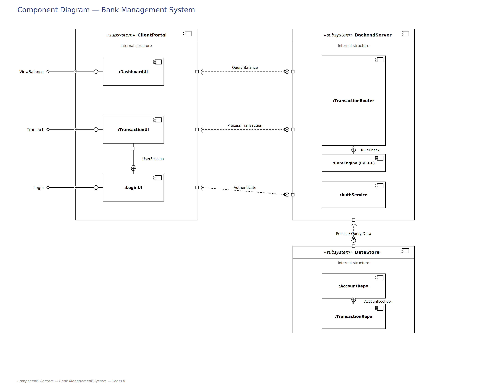

# Software Architecture and Design Specification

**Project:** Bank Management System
**Version:** 1.0
**Authors:** Team 6 — Ganavi Purushothama, DEVOPAM PAL, DEEPTHI V, Divyanshi Verma
**Date:** 12-09-2026
**Status:** Draft

## Revision History

| Version | Date | Author | Change Summary |
|---|---|---|---|
| 1.0 | 12-09-2026 | Team 6 | Initial SAD draft, based on Node.js/Express + C/C++ Core Engine + SQL architecture |

## Approvals

| Role | Name | Signature/Date |
|---|---|---|
| Course Coordinator | | |
| Team Lead | Ganavi Purushothama | |
| Team Meamber | Devopam Pal | |
| Team Meamber| Deepthi | |
| Team Meamber| Divyanshi Verma | |


---

# 1. Introduction

## 1.1 Purpose

This document specifies the software architecture and design of the **Bank Management System**, covering component structure, chosen architecture pattern, technology stack, security design, and API contracts. It complements the SRS (`SRS.md`) by describing *how* the requirements are realized in the system's structure.

## 1.2 Scope

Covers the web-hosted Bank Management System's services: account registration/login, deposit, withdrawal, balance inquiry, transaction history, and admin account management. The core banking rule validation is implemented in C/C++ and invoked by a Node.js/Express backend; data is persisted in a SQL database.

## 1.3 Audience

Developers (Team 6), QA reviewers, course instructor/evaluator, and anyone maintaining or extending the system after submission.

## 1.4 Definitions

| Term | Definition |
|---|---|
| Core Engine | The compiled C/C++ executable that performs banking business logic (balance rules, validation) |
| IPC | Inter-Process Communication — how Node.js invokes the Core Engine |
| API | Application Programming Interface |
| ADR | Architecture Decision Record |
| RBAC | Role-Based Access Control |
| ORM | Object-Relational Mapping |
| PIN | Personal Identification Number |

---

# 2. Document Overview

## 2.1 How to use this document

This document provides the architectural deliverables for the project: a component diagram, sequence diagrams for key flows, API design for the Node.js ↔ Core Engine and browser ↔ server interfaces, security architecture (STRIDE threat model), and traceability back to the SRS requirements.

## 2.2 Related Documents

- `SRS.md` — Software Requirements Specification
- `BMS_UseCase_Diagram_circular.drawio` — UML use-case diagram
- `BMS_Component_Diagram.drawio` — component/architecture diagram (this document)
- `BMS_Sequence_Deposit.drawio`, `BMS_Sequence_Login.drawio` — sequence diagrams (this document)

---

# 3. Architecture

## 3.1 Goals & Constraints

**Goals:**
- Correct enforcement of banking rules (no negative balances, minimum balance, valid transactions)
- Reasonably secure handling of credentials and financial data for a course project
- Simple enough for a 4-person team to build and integrate within a semester timeline
- Deployable/hostable so the system is reachable online, not just offline/console

**Constraints:**
- Core banking logic must be implemented in C/C++ (course mandate)
- Team is more comfortable with JavaScript/web tooling than raw C/C++ web frameworks, so the web layer is Node.js/Express rather than a C++ web server
- Academic timeline — security and scalability handled to a reasonable, not production-banking, standard

## 3.2 Stakeholders & Concerns

| Stakeholder | Concern |
|---|---|
| Customers (demo users) | Security of their account data, correctness of balances, ease of use |
| Course Instructor/Evaluator | Correct use of C/C++ as required, sound architecture, clear documentation |
| Development Team | Modularity (so members can work on separate parts without blocking each other), maintainability, feasibility within timeline |
| Admin/Bank Ops role (in-app) | Ability to manage accounts and see system state reliably |

## 3.3 Component (UML) Diagram

See `BMS_Component_Diagram.drawio`. Summary of components:



## 3.4 Component Descriptions

- **Browser (Frontend):** Renders login, dashboard, deposit/withdraw/balance/statement pages; submits form data via HTTP requests.
- **Express Server (Backend):** Handles routing, authentication/session management, request validation, and reads/writes account and transaction data in the SQL database. Delegates rule-sensitive operations to the Core Engine.
- **Auth Middleware:** Verifies session validity on protected routes; enforces RBAC for admin-only routes.
- **C/C++ Core Engine:** Stateless executable invoked per request for deposit/withdrawal validation — receives current balance, amount, and rule parameters (e.g., minimum balance), returns an approve/reject decision and the resulting balance.
- **SQL Database:** Stores accounts (with hashed credentials), transaction history, and session/security event logs.

## 3.5 Chosen Architecture Pattern and Rationale

**Pattern chosen: Layered Architecture** (Presentation → Application/Backend → Business Logic (Core Engine) → Data)

**Rationale:** A layered architecture cleanly separates the web-facing concerns (routing, sessions, HTTP) from the banking business logic (kept in C/C++ as required) and from persistence (SQL database). This lets team members work on the frontend, backend routes, Core Engine, and database schema largely independently, integrating through well-defined interfaces (HTTP routes, and the Core Engine's input/output contract).

**Alternatives considered:**
- *Full C/C++ web server (no Node.js layer):* rejected for this version — while it avoids a bridging step, it requires the team to learn a C++ web framework (e.g., Crow, Pistache) from scratch, which is a higher-risk, steeper learning curve for a course timeline than using Express.
- *Microservices:* rejected as unnecessary complexity for a single-team, single-deployment academic project of this scale.

## 3.6 Technology Stack & Data Stores

| Layer | Technology |
|---|---|
| Frontend | HTML, CSS, JavaScript |
| Backend/Web Server | Node.js + Express |
| Core Business Logic | C/C++ (compiled executable, invoked via Node's `child_process`) |
| Database | SQL — SQLite (local/dev) or PostgreSQL/MySQL (if hosted) |
| Session Management | Express-session (or equivalent) with signed cookies |
| Password Hashing | bcrypt (or equivalent salted-hash library) |
| Transport Security | HTTPS if deployed to a public host |

## 3.7 Risks & Mitigations

| Risk | Mitigation |
|---|---|
| Node.js ↔ Core Engine IPC contract mismatch (input/output format disagreement between whoever writes each side) | Freeze the IPC contract (Section 4.3) early and document it before implementation begins |
| Per-request process spawn adds latency | Acceptable at course-project traffic scale; documented as a known trade-off, not a blocker |
| Team inexperience with child_process / C++ compilation on different OSes | Standardize on one OS or use WSL/Docker for consistent builds across teammates' machines |
| Hosting platform doesn't support running a compiled C/C++ binary alongside Node | Fallback plan: local hosting for the demo (see SRS Section 9.3) |
| SQL injection or credential leakage | Parameterized queries (Section 3.9) and bcrypt hashing enforced from the start |

## 3.8 Traceability to Requirements

| Req ID (from SRS) | Requirement | Component |
|---|---|---|
| BMS-F-007 | Authenticate user | Auth Middleware, Express Server |
| BMS-F-010 | Deposit funds | Express Server (route) + C/C++ Core Engine (validation) |
| BMS-F-013 | Withdraw funds | Express Server (route) + C/C++ Core Engine (validation) |
| BMS-F-016 | Balance inquiry | Express Server + SQL Database |
| BMS-F-019 | Persist data | SQL Database |
| BMS-SR-002 | Hash PINs/passwords | Auth Middleware (bcrypt) |
| BMS-SR-006 | Prevent SQL injection | Database Access Layer (parameterized queries) |

## 3.9 Security Architecture

**Threat Modeling (STRIDE):**

| Threat | Mitigation |
|---|---|
| **S**poofing | Session-based authentication; account lockout after 3 failed login attempts |
| **T**ampering | Core Engine is the sole authority on balance changes — the frontend/DB cannot set a balance directly, only through a validated transaction |
| **R**epudiation | All deposits/withdrawals logged with timestamp in the transactions table; security events (failed logins, lockouts) logged separately |
| **I**nformation Disclosure | Passwords/PINs hashed (bcrypt), never logged or returned in API responses; HTTPS in any public deployment |
| **D**enial of Service | Basic rate-limiting on login attempts (ties into account lockout); out of scope for full DDoS protection given project scale |
| **E**levation of Privilege | RBAC — admin-only routes check session role server-side before executing, not just hidden in the UI |

---

# 4. Design

## 4.1 Design Overview

The system follows the layered architecture from Section 3, with the C/C++ Core Engine as a distinct, testable unit responsible only for rule evaluation — no HTTP or database concerns leak into it. This keeps the "must use C/C++" requirement meaningfully central to the system rather than incidental.

## 4.2 UML Sequence Diagrams

Two key flows are diagrammed:

1. **Login/Authentication flow** — see `BMS_Sequence_Login.drawio`
2. **Deposit flow (including Core Engine validation)** — see `BMS_Sequence_Deposit.drawio`

## 4.3 API Design

### 4.3.1 Browser ↔ Express API

**Endpoint:** `POST /api/deposit`
- **Request:** `{ accountNumber, amount }` (session cookie required)
- **Response (success):** `{ status: "APPROVED", newBalance: 4500 }`
- **Response (failure):** `{ status: "REJECTED", reason: "Invalid amount" }`
- **Errors:** `401 Unauthorized` (no session), `400 Bad Request` (malformed input)

**Endpoint:** `POST /api/login`
- **Request:** `{ accountNumber, password }`
- **Response (success):** `{ status: "OK" }` + session cookie set
- **Response (failure):** `{ status: "FAILED", attemptsRemaining: 2 }`
- **Errors:** `401 Unauthorized` (bad credentials), `423 Locked` (account locked after 3 failed attempts)

### 4.3.2 Express ↔ Core Engine Interface (IPC Contract)

The Core Engine is invoked as a child process per operation. Input and output are passed as a single-line JSON string over stdin/stdout to keep parsing simple on both sides.

**Input (stdin), example for a withdrawal:**
```json
{"operation": "WITHDRAW", "currentBalance": 5000, "amount": 1200, "minBalance": 500}
```

**Output (stdout):**
```json
{"status": "APPROVED", "newBalance": 3800}
```
or
```json
{"status": "REJECTED", "reason": "Insufficient funds below minimum balance"}
```

This contract must be agreed and frozen by whoever implements the Node.js side and whoever implements the C/C++ side before either starts coding against it.

## 4.4 Error Handling, Logging & Monitoring

- Standardized JSON error responses (`{status, reason}`) across all API routes — no raw stack traces or internal error details sent to the client.
- No sensitive information (passwords, full PINs, raw hashes) written to logs.
- Logged events: failed logins, account lockouts, account deletions/closures, and Core Engine rejections (for debugging rule logic).
- For a course project, monitoring is manual (console/log file review) rather than an automated dashboard, given scope.

## 4.5 UX Design

- Clear, minimal web forms for each action (login, deposit, withdraw, balance, statement) with inline validation messages.
- Dashboard page shows current balance prominently after login.
- Error states (e.g., insufficient funds, invalid input) shown directly on the relevant form, not as a generic failure page.
- Admin dashboard kept visually distinct from the customer-facing pages to reduce accidental navigation into admin-only areas.

## 4.6 Open Issues & Next Steps

- Finalize choice of SQL database (SQLite for simplicity vs. PostgreSQL/MySQL if hosted publicly) — see SRS Section 9.
- Confirm and freeze the Core Engine IPC contract (Section 4.3.2) before parallel development starts.
- Decide on public hosting platform vs. local-hosting-only fallback for the final demo.
- Future enhancement (out of current scope): multi-factor authentication, interbank transfer simulation.

---

# 5. Appendices

## 5.1 Glossary

Core Engine, IPC, API, ADR, RBAC, ORM, PIN, SRS, STRIDE.

## 5.2 References

- IEEE 830 (SRS structure basis)
- OWASP Top 10 (web security considerations)
- Node.js `child_process` documentation

## 5.3 Tools

- draw.io — component and sequence diagrams
- Node.js / Express — backend framework
- GCC/G++ — Core Engine compilation
- GitHub — version control and collaboration
